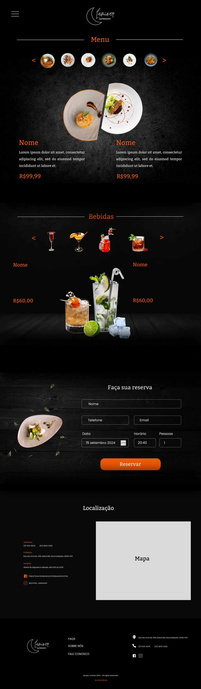

<h1 align="center"> Restaurante Luminar </h1>

Desafio opcional da trilha Onboarding. Este foi um desafio proposto pelo programa <a href="https://descodificadas.com.br/">Descodificadas</a>!

 

  <a href="#-tecnologias">Tecnologias</a>&nbsp;&nbsp;&nbsp;|&nbsp;&nbsp;&nbsp;
  <a href="#-projeto">Projeto</a>&nbsp;&nbsp;&nbsp;|&nbsp;&nbsp;&nbsp;
  <a href="#-layout">Layout</a>

 

  

## 🚀 Tecnologias

Esse projeto foi desenvolvido com as seguintes tecnologias:

- HTML e CSS
- Git e Github
- Figma
- Javascript
- Bootstrap

## 💻 Projeto
O Luminar é um restaurante fictício que busca proporcionar uma experiência culinária única e inovadora. Este site foi criado como parte de um desafio opcional proposto no curso, com o objetivo de aplicar os conhecimentos adquiridos em HTML para a estrutura da página, CSS para o design e estilo, e JavaScript para interatividade e dinamismo.
 

  

- Visite o projeto online: https://github.com/KAYSILVHA/luminar_restaurant

## 🔖 Layout

Você pode visualizar o layout do projeto através [DESSE LINK](https://www.figma.com/file/a8dTSP9aOkp7nIUdJ0HLuv/LUMINAR-RESTAURANT?type=design&node-id=0%3A1&mode=design&t=bz5skgl04qGKveXb-1). É necessário ter conta no [Figma](https://figma.com) para acessá-lo.
